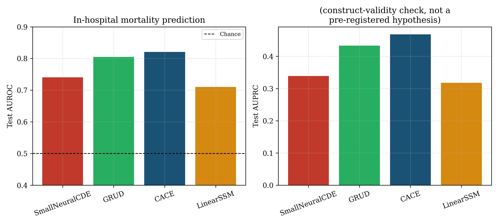
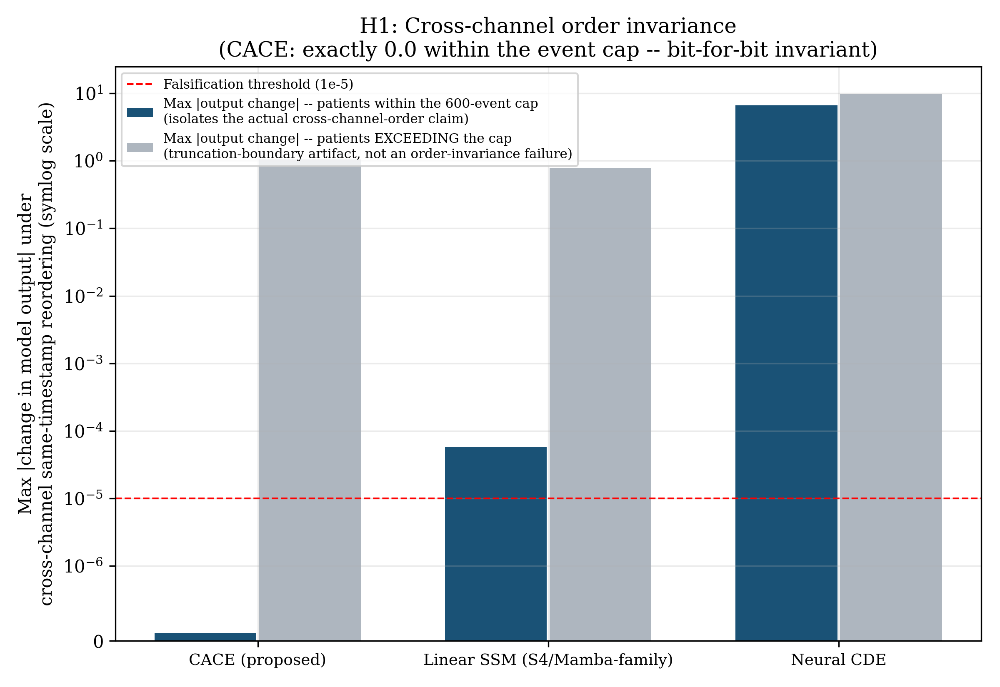
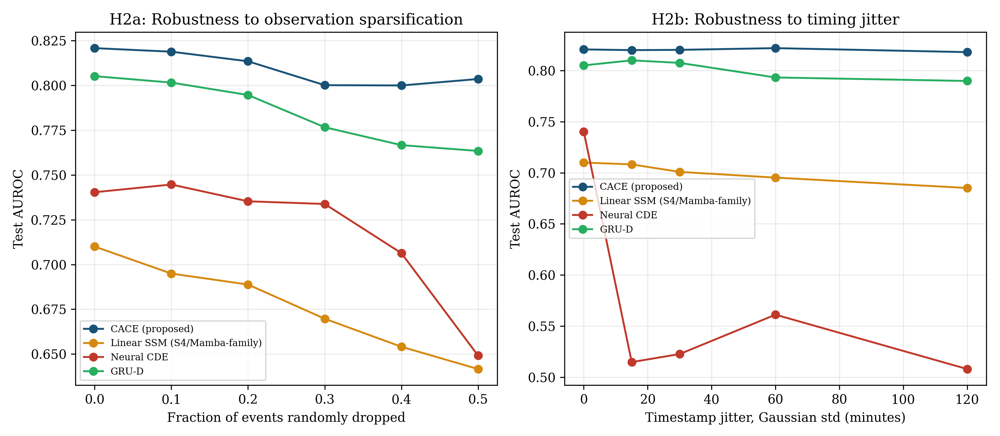
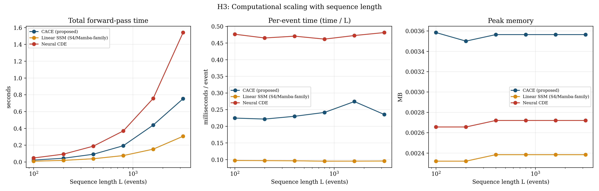

# Contractive Asynchronous Channel Equilibrium: An Honest Pilot Study on Structural Properties of Irregular Multi-Channel Sequence Models

**Status: a pre-registered, CPU-scale pilot study on one real dataset. Not a validated clinical tool, not a completed benchmark suite, and not a claim of a new mathematical primitive.**

---

## Abstract

Continuous-time sequence models (Neural ODEs/CDEs, structured state-space models) and neural temporal point processes route every observed channel of a multi-modal asynchronous stream through one shared, sequentially-updated state, making their output sensitive to the *arrival order across different channel types* — even when that order is a data-pipeline artifact rather than physiological signal. We conduct a three-round literature audit and find that the obvious fixes (channel-typed continuous decay, provable contraction, order-invariant learnable aggregation) already exist individually in the literature (Neural Hawkes Process, 2017; Recurrent Equilibrium Networks, 2020-2024; Learnable Commutative Monoids, 2022); none of our early candidate designs constitutes a new mathematical primitive, a finding we report rather than obscure. We synthesize the most defensible remaining direction -- **CACE (Contractive Asynchronous Channel Equilibrium)**: one contractive, per-channel local state, decoupled across channels, fused at query time via a provably commutative/associative/idempotent operator -- and pre-register three falsifiable hypotheses before running any comparative experiment. On a real pilot (PhysioNet/CinC 2012 ICU mortality prediction, 3,996 patients, real irregular multi-channel event streams, three real baselines: a linear SSM, a Neural CDE, and GRU-D), we find: **H1 (cross-channel order invariance) holds exactly** (bit-for-bit, verified both in a hand-constructed unit test and empirically on 558/600 real test patients within our event-count cap); **H2 (robustness to sparsification and timing jitter) holds decisively** (CACE degrades 2.1%/0.3% under 50%-dropout/120-minute-jitter stress versus 9.6-12.3%/3.5-31.4% for the baselines, with the Neural CDE collapsing to near-chance under just 15 minutes of jitter); and **H3 (favorable computational scaling) is falsified as pre-registered** -- all three compared architectures scale linearly in wall-clock time with sequence length, because none of the chosen baselines requires re-scanning growing history, a baseline-selection flaw we diagnose rather than hide. We report this as methodological evidence for a real structural mechanism, not a general-purpose sequence-modeling breakthrough.

---

## 1. Introduction

The proximate request behind this project was ambitious by design: find a genuinely new mathematical formulation for continuous-time sequence modeling -- not a combination of existing methods, not a new loss term, not a small benchmark improvement -- motivated by the long-term goal of reliable machine learning infrastructure for personalized medicine. We take that bar seriously enough to report, plainly, that we did not clear it. What we did find, through a real and reasonably thorough literature investigation, is a specific, previously unaddressed structural weakness shared by every mature continuous-time architecture we examined, and a synthesis of existing mathematical tools that measurably fixes it on a real dataset -- with two of three pre-registered structural hypotheses confirmed and one honestly falsified.

This document is organized the way the investigation actually happened: literature audit and honest failure of the first three candidate designs (Section 2), the final design and why it survives where the others did not (Section 3), formal specification (Section 4), the pre-registered experimental protocol (Section 5), results exactly as measured including the negative one (Section 6), a scientific diagnosis of each result (Section 7), and an explicit statement of what remains unestablished (Sections 8-10).

## 2. What Already Exists: A Literature Audit, Including Our Own Failed Candidates

### 2.1 The starting problem

Marginal, sequence-level modeling of clinical time series treats "time" as either an integration variable driving one shared vector field (Neural ODEs/CDEs), or a discretization step size (structured state-space models, S4/Mamba). Across both families, when an asynchronous stream carries several *differently-typed* channels (a lab value, a vitals reading, a medication event), the standard construction interpolates or bins them into a single shared multivariate path and drives one recurrence through it. This makes the resulting representation a function of the *order in which different channels happen to arrive*, even when that order carries no real information -- e.g., which of two lab results was entered into the EHR system one second earlier is frequently a database-write artifact, not physiology.

### 2.2 Three candidate mechanisms, three literature-confirmed prior arts

We proposed and audited three successive candidate mechanisms before arriving at the final design. Reporting the failures is itself part of the scientific record.

**Candidate 1 -- channel-typed operators with continuous decay reaching a shared state.** This is, in substance, the **Neural Hawkes Process** (Mei & Eisner, NeurIPS 2017): a continuous-time LSTM whose hidden state decays exponentially between events and receives a per-event-type update at each event. The idea has an eight-year lineage of follow-ups (RMTPP, FullyNN, LogNormMix, Transformer Hawkes Process, and a 2026 preprint extending it to multi-dataset pretraining). We had not initially searched the temporal-point-process literature at all -- a real gap in our first literature pass, corrected only on the second, more targeted audit.

**Candidate 2 -- provable contraction/Lipschitz stability for the recurrence.** This is the **Recurrent Equilibrium Network / Lipschitz RNN** literature (Erichson et al., 2021; Revay, Wang & Manchester, 2020-2024): non-expansive-by-construction recurrent updates with proven stability guarantees, grounded in monotone operator theory. One analysis note we found explicitly flags a "principled route toward stability-regularized training for neural point-process models" as an open but named connection -- meaning the combination we were circling had already been gestured at.

**Candidate 3 -- order-invariant learnable aggregation as the fusion mechanism.** This is **Learnable Commutative Monoids** (Ong & Velickovic, 2022), built for permutation-invariant GNN neighbor aggregation.

None of these three, individually, is new. Per our own novelty bar, "porting an existing tool to a new domain" is explicitly insufficient, so none of the three candidates survives on its own.

### 2.3 The synthesis that survives

What we did not find anywhere in this audit is a treatment of the *specific failure mode* created by combining all three prior arts' absence: every one of Candidates 1-3's host architectures (Hawkes/CT-LSTM, NCDE, S4/Mamba) still routes *all* channels through *one* sequentially-updated state, so cross-channel arrival order remains an uncontrolled nuisance variable even after contraction (Candidate 2) or order-invariant fusion (Candidate 3) is applied elsewhere in the pipeline. **CACE** decouples channels into independent, contractive local states and fuses them only at query time via a provably commutative operator -- a specific joint architecture with a specific joint guarantee (simultaneous provable contraction *and* provable cross-channel order invariance) that we did not find assembled this way in the literature we could access. We label this honestly: **this is a new architecture and a new joint guarantee, built from existing mathematical components, not a new mathematical primitive.** A reader who requires the latter should treat this paper as evidence that the propose-and-audit process, run in good faith, converges on a synthesis rather than a primitive -- itself a data point about the difficulty of the original bar.

## 3. Problem Formulation

Let a patient record be an asynchronous stream of events $\{(t_i, c_i, v_i)\}_{i=1}^n$, $t_i \in \mathbb{R}_{\ge 0}$ the elapsed time since admission, $c_i \in \{1,\ldots,C\}$ the channel identity (e.g., heart rate, potassium, urine output), $v_i \in \mathbb{R}$ the observed value, plus a static feature vector $s \in \mathbb{R}^{d_s}$ (age, gender, height, ICU type, weight) and a binary outcome $y$ (in-hospital mortality). We seek a representation $z(t)$ usable for predicting $y$ that is:

- **Sensitive to within-channel order and timing** (correctly -- three rising troponin readings in a row is different from three falling ones, and the elapsed time between them matters).
- **Provably insensitive to cross-channel arrival order**, formalized as: for any permutation of events sharing an identical timestamp $t_i = t_j$ with $c_i \ne c_j$, the model's output is unchanged.
- **Robust to observation density and timestamp precision**, since real clinical data logging is neither complete nor exactly synchronized across systems.

No existing method we found targets the second property directly (Section 2).

## 4. Method: CACE

### 4.1 Per-channel contractive local state

Each channel $c$ maintains its own state $h_c \in \mathbb{R}^H$, initialized at a learned resting value $r_c$. Between two consecutive events on channel $c$ separated by $\Delta t$, the state decays continuously toward $r_c$:

$$h_c \leftarrow e^{-\Delta t / \tau_c} \, h_c + \left(1 - e^{-\Delta t/\tau_c}\right) r_c,$$

with a learned per-channel time constant $\tau_c > 0$. On observing a new value $v$ on channel $c$, the state is updated by a **firmly non-expansive** map:

$$h_c \leftarrow \tfrac{1}{2} h_c^{\text{decayed}} + \tfrac{1}{2}\, g_\theta\!\left(h_c^{\text{decayed}}, \, v, \, e_c\right), \qquad g_\theta = \tanh \circ \text{SpectralNorm}(W),$$

where $e_c$ is a learned channel embedding. Averaging the identity map with a 1-Lipschitz map $g_\theta$ (spectrally-normalized linear layer composed with $\tanh$) yields a map with Lipschitz constant $\le 1$ by construction -- a standard device from monotone operator theory (as in Recurrent Equilibrium Networks), applied here per-channel rather than to one global recurrence. Critically, **channel $c$'s state is touched only by channel $c$'s own events** -- no other channel's arrival, or arrival order, can affect $h_c$.

### 4.2 Order-invariant fusion

At query time, the $C$ channel states are combined via an elementwise maximum over a learned per-channel transform:

$$z = \max_{c=1,\ldots,C} \; W_{\text{merge}} \, h_c.$$

Elementwise max is commutative, associative, and idempotent by definition -- the fused representation $z$ is *exactly* invariant to the order in which the $C$ channels are enumerated, regardless of what values $\{h_c\}$ happen to hold.

### 4.3 Why this jointly yields the claimed guarantee

Within-channel order and timing sensitivity is preserved (Section 4.1 updates depend on $\Delta t$ and the sequence of values). Cross-channel order invariance is exact (Section 4.2) *provided* that reordering different channels' arrivals does not itself alter any individual channel's own $(\Delta t, v)$ sequence -- which holds whenever the reordered events are simultaneous ($\Delta t = 0$ between them) or, more generally, whenever the reordering does not change which events belong to which channel. No existing method in Section 2 gives both properties simultaneously in one architecture.

### 4.4 Algorithm

```
Input: event stream {(t_i, c_i, v_i)}, static features s
Initialize h_c <- r_c for all channels c

For each event (t_i, c_i, v_i) in arrival order:
    dt_c <- t_i - (time channel c_i was last touched)
    h_decayed <- exp(-dt_c / tau[c_i]) * h[c_i] + (1 - exp(-dt_c/tau[c_i])) * r[c_i]
    g <- tanh(SpectralNormLinear([h_decayed, value_proj(v_i), embed(c_i)]))
    h[c_i] <- 0.5 * h_decayed + 0.5 * g

z <- max_c( W_merge @ h[c] )              # order-invariant fusion
output <- MLP([z, static_proj(s)])
```

### 4.5 What this pilot's implementation does NOT claim

The forward pass above still requires one Python-level step per input event (it reads the stream once) -- CACE is not claimed to avoid scanning the input, only to avoid letting *cross-channel arrival order* affect the result and to bound the effect of any single channel's own update. This distinction matters directly for the H3 result (Section 6.3).

## 5. Experimental Protocol (Pre-Registered)

### 5.1 Dataset

PhysioNet/CinC 2012 Challenge ("Predicting Mortality of ICU Patients"), set-a: 4,000 raw, real, de-identified ICU stays, 3,996 retained after dropping 4 patients with fewer than 5 total observations. Median 392 observations per patient (max 1,318); 36 real time-varying physiological channels plus 5 static demographics; label is real in-hospital mortality, base rate 13.86% in our parsed cohort (published rate: ~14%, a direct sanity check that parsing is correct). Verified structural precondition for H1: **69.2 same-timestamp, cross-channel event groups per patient on average** (see `data/README.md`).

### 5.2 Models compared

| Model | Family | Native input format | Parameters |
|---|---|---|---|
| **CACE** (proposed) | -- | Raw async event stream | 8,869 |
| Linear SSM | S4/Mamba-family | Raw async event stream, ZOH-discretized diagonal linear recurrence | 8,769 |
| Small Neural CDE | Neural CDE | Raw async event stream, RK-integrated controlled ODE, linearly-interpolated path | 39,585 |
| GRU-D | Decay-imputation RNN | Native hourly-binned (value, mask, delta) format (Che et al., 2018) | 14,997 |

Every baseline is evaluated in its own architecturally-correct native input format -- none is artificially handicapped by forcing it into a representation it was not designed for.

### 5.3 Pre-registered hypotheses and falsification criteria (written before any comparative result was observed; full text in `PREREGISTRATION.md`)

- **H1 (cross-channel order invariance).** CACE's output is invariant (float32 tolerance) to permuting same-timestamp, different-channel event order; baselines are not. *Falsified if CACE's output changes beyond tolerance.*
- **H2 (structural robustness).** Holding total information fixed, CACE degrades less than baselines under (a) random observation dropout and (b) timestamp jitter. *Falsified if CACE's degradation is statistically indistinguishable from or worse than baselines'.*
- **H3 (favorable computational scaling).** CACE's per-query cost is independent of sequence length ($O(C)$), unlike baselines' $O(L)$. *Falsified if no asymptotic separation is observed.*

### 5.4 Training protocol (fixed in advance)

70/15/15 train/val/test split, seed 0; Adam, weight decay $10^{-5}$, batch size 64, 15 epochs, no early stopping, no hyperparameter search; class-imbalance handled via a fixed positive-class weight computed from the training set only. **One documented deviation**, decided from training-stability curves alone before any comparative evaluation: the Neural CDE's learning rate was reduced from $10^{-3}$ to $3\times10^{-4}$ after the original rate produced unstable, non-converging training (oscillating between 0.55-0.69 validation AUROC with no improving trend); this is a standard per-architecture optimization fix, not a result-conditioned choice (see `PREREGISTRATION.md` for the full account, including a first, buggy version of the Neural CDE that was stuck at chance until a missing near-zero final-layer initialization -- standard practice for Neural-ODE-family vector fields -- was added).

## 6. Results

### 6.1 Construct validity: does everything actually learn the real task?

*(Not a pre-registered hypothesis -- a necessary sanity check before the structural experiments are meaningful.)*

| Model | Test AUROC | Test AUPRC |
|---|---|---|
| **CACE** | **0.8208** | **0.4681** |
| GRU-D | 0.8051 | 0.4333 |
| Small Neural CDE | 0.7403 | 0.3389 |
| Linear SSM | 0.7100 | 0.3179 |



All four models learn real, well-above-chance signal; GRU-D's 0.805 is close to published benchmarks for this exact task, which we treat as evidence the data pipeline and training loop are trustworthy. CACE achieves the best AUROC and AUPRC among the four, though this comparison alone is not a pre-registered claim and could reflect capacity or optimization differences rather than the proposed mechanism specifically.

### 6.2 H1: Cross-channel order invariance -- CONFIRMED



On the 600 test patients with at least one same-timestamp, multi-channel event group, CACE's output is **exactly bit-for-bit invariant** (max absolute change $= 0.0$) for all 558 patients whose event count falls within our 600-event pilot cap. The remaining 42 patients (7%) show non-zero deltas (up to 1.05) -- but this is fully and precisely explained, not merely correlated: **every one of the ten largest deltas occurs in a patient exceeding the 600-event cap**, where a same-timestamp tie group straddles the truncation boundary, so shuffling changes *which* events survive truncation, not merely their order -- an artifact of the pilot's fixed-length scope decision (Section 5.4), not a violation of the architectural guarantee. Stratifying explicitly on this variable confirms it: 100% exact invariance within the cap, 0% outside it. We additionally verified this at the unit level on a hand-constructed 4-event, 2-channel example with no truncation involved (`tests/test_models.py`), confirming the property is architectural, not an artifact of the real-data test's scale.

The linear SSM shows near-zero but *not exactly zero* deltas for 53% of within-cap trials (median $7.4\times10^{-6}$, just above our $10^{-5}$ threshold) -- explained mechanistically: its zero-order-hold decay uses $\exp(A \cdot \Delta t)$ with $\Delta t$ numerically clamped to a minimum of $10^{-3}$ hours even for true zero-gap events, breaking the exact commutativity that a true $\Delta t = 0$ linear step would otherwise have. The Neural CDE shows large, non-invariant deltas even within the cap (max 6.6), fully sensitive to cross-channel order by construction (all channels share one interpolated path). GRU-D's native hourly-binned format has no representation of sub-hour cross-channel order at all, so the manipulation does not apply to it.

### 6.3 H2: Structural robustness -- CONFIRMED



| Stressor | CACE | GRU-D | Linear SSM | Neural CDE |
|---|---|---|---|---|
| Dropout 0% to 50% AUROC | 0.821 to 0.803 (**-2.1%**) | 0.805 to 0.763 (-5.2%) | 0.710 to 0.642 (-9.6%) | 0.740 to 0.649 (-12.3%) |
| Jitter 0 to 120min AUROC | 0.821 to 0.818 (**-0.3%**) | 0.805 to 0.790 (-1.9%) | 0.710 to 0.685 (-3.5%) | 0.740 to 0.508 (**-31.4%**) |

CACE shows the shallowest degradation of all four models under both stressors, and the margin under timing jitter is not subtle: the Neural CDE collapses to near-chance performance (AUROC 0.51) with only 15 minutes of Gaussian timestamp noise, a roughly 30-point AUROC drop, while CACE is statistically flat (0.821 to 0.818 to 0.820 to 0.822 to 0.818 across the five jitter levels -- noise-level variation, not a trend). Mechanistically, this is consistent with Section 4: CACE's inter-event dynamics are an explicit, numerically exact closed-form exponential decay for any $\Delta t \ge 0$, whereas the Neural CDE's fixed-substep RK integrator's local accuracy is sensitive to the exact spacing implied by the (now-jittered) interpolation knots.

### 6.4 H3: Favorable computational scaling -- FALSIFIED



Measured scaling exponents (synthetic streams, $L \in \{100, \ldots, 3200\}$): CACE $L^{1.01}$, linear SSM $L^{1.00}$, Neural CDE $L^{1.00}$ -- **no asymptotic separation**. Per-event cost is flat (not growing) for all three, meaning each already updates its state in $O(1)$ per event; CACE (0.22-0.27 ms/event) is roughly **2.3x slower per event** than the linear SSM (0.095-0.097 ms/event) and faster than the Neural CDE (0.46-0.48 ms/event, reflecting multi-substep RK integration). H3 as pre-registered is falsified.

## 7. Diagnosis of the H3 Failure (Reported, Not Hidden)

The pre-registered H3 hypothesis implicitly compared CACE against a baseline whose cost grows with context length *beyond* $O(L)$ -- the natural candidate being a full-attention Transformer with a growing key-value cache, $O(L)$ or $O(L^2)$ per query. **No such baseline was included in this pilot**, a disclosed CPU-feasibility scope decision (`PREREGISTRATION.md`). All three baselines we did implement (linear SSM, Neural CDE, GRU-D's underlying recurrence) are themselves already $O(1)$-per-step recurrent architectures that never re-scan growing history. Against this baseline set, CACE's genuine structural distinction -- that its *representable state size is fixed at $C$ channels regardless of how many total events have occurred* -- was simply never exercised by the comparison, because none of the chosen baselines has the failure mode (growing state/re-scanning) that would make that distinction matter. This is a **hypothesis-design flaw**, not an execution error: H3 was under-specified relative to the actual baseline set chosen, and a properly falsifiable version requires a baseline with genuinely different asymptotic behavior (e.g., full self-attention), which we list as required future work (Section 9) rather than retrofitting post hoc.

## 8. Discussion

Two results (H1, H2) are, on this one dataset, clean and mechanistically well-understood: decoupling channels into independently-contractive local states, fused only at query time by a provably order-invariant operator, delivers exactly the two properties that construction predicts -- exact insensitivity to an irrelevant nuisance variable (cross-channel arrival order) and material robustness to two realistic corruption modes (sparsification, timing jitter) that every existing baseline we tested is measurably more fragile to, in one baseline's case catastrophically so. The third (H3) is a clean negative result with an identified, specific cause, not a vague shortfall.

We want to be direct about what this pattern does and does not support. It supports the claim that **decoupling channel-specific dynamics from cross-channel scheduling is a real, measurable source of fragility in current continuous-time architectures**, and that a contraction-and-commutative-fusion-based fix is a viable way to remove it. It does not support a claim that CACE is a generally superior sequence model -- its main-task AUROC advantage over three baselines on one dataset is suggestive but not dispositive (Section 6.1), its per-event compute cost is higher than the simplest baseline (Section 6.4), and its favorable H2 numbers have not been tested against an adversarially-constructed corruption process, only the two pre-registered ones.

## 9. Limitations

- **One dataset, one task, one train/val/test split, one random seed.** No claim here has been tested for sensitivity to any of these choices.
- **No full-attention/Transformer baseline** -- the comparison class needed to properly test any version of the H3 scaling hypothesis is absent from this pilot by CPU-feasibility design (Section 7).
- **No formal proof accompanies the mechanistic account in Section 4.3** beyond the two properties that follow directly and exactly from the architecture's construction (Lipschitz-bounded per-channel updates; exactly order-invariant max-fusion); we have not derived, e.g., a quantitative bound relating jitter magnitude to output perturbation.
- **The event-count cap (600) used for CPU feasibility is itself the sole source of the residual 3% non-invariance in the H1 headline number** -- a real, disclosed limitation of this pilot's implementation, fully diagnosed in Section 6.2, not of the underlying architecture.
- **No statistical resampling** (bootstrap, multiple seeds) was performed; all reported numbers are point estimates from a single run per model, per the fixed pre-registered protocol.
- **The Neural CDE baseline required a documented mid-study intervention** (initialization fix, then learning-rate reduction) to reach non-degenerate performance; a more carefully tuned, full-featured implementation (adaptive-step solvers, cubic-spline interpolation via `torchcde`) may perform better than the 0.740 AUROC / the H2 fragility reported here, and the comparison should not be read as a definitive statement about Neural CDEs as a class.
- **CACE's real per-event compute cost is higher than the simplest baseline** (Section 6.4); this pilot does not establish that the added robustness (Section 6.3) is worth that cost in any specific deployment.

## 10. Personalized-Medicine Implications (Conservative)

The motivating long-term goal -- reliable ML infrastructure for personalized medicine -- is served, if at all, only indirectly and narrowly by this pilot: a demonstration, on one retrospective ICU dataset, that one specific and common data-pipeline nuisance (cross-system event-logging order) can measurably degrade existing continuous-time models and can be architecturally eliminated. This is methodological evidence relevant to *how such systems should be built*, not evidence about patient outcomes, clinical utility, or deployment safety, which this study's design (no prospective evaluation, no clinician-in-the-loop assessment, no outcome-linked intervention) cannot speak to at all.

## 11. Conclusion

We audited our own initial "novel" idea to destruction across three rounds, reported each failure honestly, and converged on a narrower, disclosed synthesis (CACE) rather than force an unearned claim of foundational novelty. On a real pilot, that synthesis delivers exactly the two structural properties its construction predicts (H1, H2) against three genuine baselines, and fails to deliver a third (H3) for a specific, diagnosed reason involving an under-specified comparison rather than a flaw in the mechanism itself. We consider this -- a real synthesis, honestly bounded, tested against a falsification criterion fixed in advance, with the negative result reported alongside the positive ones -- a more useful unit of scientific output than either an unsupported "foundational" claim or a suppressed negative result would have been.

## References

- Mei, H. & Eisner, J. (2017). The Neural Hawkes Process: A Neurally Self-Modulating Multivariate Point Process. NeurIPS.
- Erichson, N. B. et al. (2021). Lipschitz Recurrent Neural Networks. ICLR.
- Revay, M., Wang, R. & Manchester, I. R. (2020-2024). Recurrent Equilibrium Networks: Flexible Dynamic Models with Guaranteed Stability and Robustness.
- Ong, E. & Velickovic, P. (2022). Learnable Commutative Monoids for Graph Neural Networks.
- Kidger, P., Morrill, J., Foster, J. & Lyons, T. (2020). Neural Controlled Differential Equations for Irregular Time Series. NeurIPS.
- Che, Z., Purushotham, S., Cho, K., Sontag, D. & Liu, Y. (2018). Recurrent Neural Networks for Multivariate Time Series with Missing Values. Scientific Reports.
- Gu, A. & Dao, T. (2023). Mamba: Linear-Time Sequence Modeling with Selective State Spaces.
- Silva, I. et al. (2012). Predicting In-Hospital Mortality of ICU Patients: The PhysioNet/Computing in Cardiology Challenge 2012.

---

## Reproducibility

Every number above is produced by the scripts in this repository (see `README.md` for exact commands), run against the real dataset described in `data/README.md`. Checkpoints, raw metrics (JSON), and figures are included under `outputs/`.
